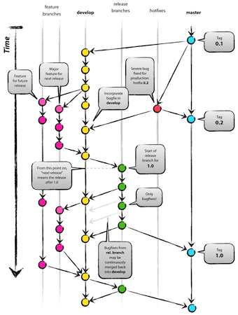
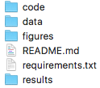

## Current scenario (not only in academia)

- A reasonable number of research projects rely on in-house developed software
    + these softwares vary from small scripts to thousands of lines of code

- Lack of formal training in software engineering practices leads to software that works but isdifficult to maintain

- How does it affect us?
    - Uncertainty about how specific changes affect the software behaviour
    - Tracking or reproducing bugs take longer
    
## What can we do to make our lives easier?

Before we start coding

- Create a virtual environment
- Create and keep updated requirements.txt
- Create a git repository and use .gitignore 
    - Even better, create a template and clone it on every new project
    - If you don't have one, start with this (https://github.com/py5gol/python-template)

## What can we do to make our lives easier?

Once you started

- Follow a Git workflow
- Keep a simple and coherent folder system
- Write clear code
- Use tools to enforce a style guide

## Create a virtual environment

I like to keep all my virtual environments in one folder called *envs*

```{bash, eval=FALSE}
cd ~/

mkdir envs

python3 -m venv envs/<newproject>
```

- Activate the *newproject* environment with

```{bash, eval=FALSE}
source envs/<newproject>/bin/activate
```

- And, now we can install packages without affecting other projects

```{bash, eval=FALSE}
pip install <packagename>
```

## Create and keep updated requirements.txt

"Requirements files" are files containing a list of items to be installed using pip install like so:

```{bash, eval=FALSE}
pip install -r requirements.txt
```

If you already have an python environment and would like to start using requirements.txt, try:

```{bash, eval=FALSE}
pip freeze > requirements.txt
```

The command above create a requirements.txt file with all packages and versions available in the current environment.

## Create a git repository and use .gitignore

Git can be very scaring at the beginning with its multiple command line options and confusing concepts, but we don't need to know much to start using:

- Start choosing a service such as GitHub or Bitbucket and create an account and a repository.

- There are lots of very good tutorials available. Choose one and try the first steps.

    + https://www.atlassian.com/git/tutorials
    + https://www.codeschool.com/courses/try-git
    + https://git-scm.com/doc

## Follow a Git workflow 



## Follow a Git workflow

```{bash, eval=FALSE}

git pull origin develop

git checkout -b newfeature

work work work! is it ok? ready to merge?

git add <files>

git commit -m 'Please, write a meaningful message!'

git checkout develop

git merge newfeature

git pull origin develop

git push origin develop
```


## Keep a simple and coherent folder system



## Write clear code

- Keep it simple
- Don't use crypt names for variables, classes, packages, or libraries 
- Choose a name convention and stick to it
- Use flake8!

## Conclusion

Use the tools that you are comfortable with, but try new tools eventually. They might give you an advantage (saving time, improving code quality, ...)

- Use virtual environment and requirements.txt
- Use Git and follow a workflow
- Keep a simple and coherent folder system
- Write clear code and use tools to enforce a style guide

## Thanks!


## References

- Dr Laura Graham slides on reproducible research in R given at BES Macroecology meeting in Oxford, 7th July 2016 [https://github.com/laurajanegraham/BES-Macroecology-2016].

- Vicent Driessen post on Git branching model [http://nvie.com/posts/a-successful-git-branching-model].
